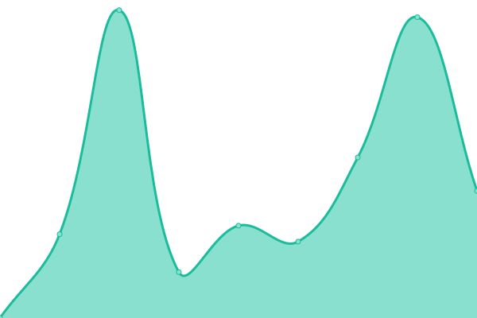

# [📈 Live Status](https://status.peaky.ai): <!--live status--> **🟩 All systems operational**

This repository contains the open-source uptime monitor and status page for [peaky.ai](https://status.peaky.ai), powered by [Upptime](https://github.com/upptime/upptime).

With [Upptime](https://upptime.js.org), you can get your own unlimited and free uptime monitor and status page, powered entirely by a GitHub repository. We use [Issues](https://github.com/peaky-ai/status-page/issues) as incident reports, [Actions](https://github.com/peaky-ai/status-page/actions) as uptime monitors, and [Pages](https://status.peaky.ai) for the status page.

<!--start: status pages-->
<!-- This summary is generated by Upptime (https://github.com/upptime/upptime) -->
<!-- Do not edit this manually, your changes will be overwritten -->
<!-- prettier-ignore -->
| URL | Status | History | Response Time | Uptime |
| --- | ------ | ------- | ------------- | ------ |
|  [Peaky Website](https://peaky.ai) | 🟩 Up | [peaky-website.yml](https://github.com/peaky-ai/status-page/commits/HEAD/history/peaky-website.yml) | 

 2484ms
     
 | 

<a href="https://status.peaky.ai/history/peaky-website">100.00%</a>
    

|  [Peaky Platform (EU)](https://eu.peaky.ai) | 🟩 Up | [peaky-platform-eu.yml](https://github.com/peaky-ai/status-page/commits/HEAD/history/peaky-platform-eu.yml) | 

 879ms
     
 | 

<a href="https://status.peaky.ai/history/peaky-platform-eu">100.00%</a>
    

|  [Peaky Trust Center](https://trust.peaky.ai) | 🟩 Up | [peaky-trust-center.yml](https://github.com/peaky-ai/status-page/commits/HEAD/history/peaky-trust-center.yml) | 

 557ms
     
 | 

<a href="https://status.peaky.ai/history/peaky-trust-center">100.00%</a>
    

<!--end: status pages-->

[**Visit our status website →**](https://status.peaky.ai)

## 📄 License

- Powered by: [Upptime](https://github.com/upptime/upptime)
- Code: [MIT](./LICENSE) © [Anand Chowdhary](https://anandchowdhary.com), supported by [Pabio](https://pabio.com)
- Data in the `./history` directory: [Open Database License](https://opendatacommons.org/licenses/odbl/1-0/)
